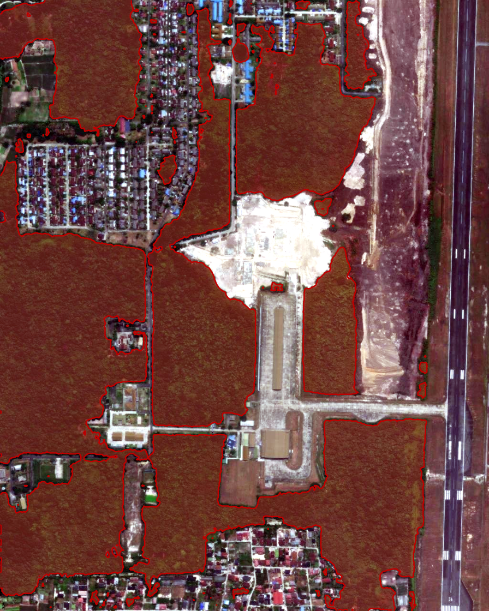
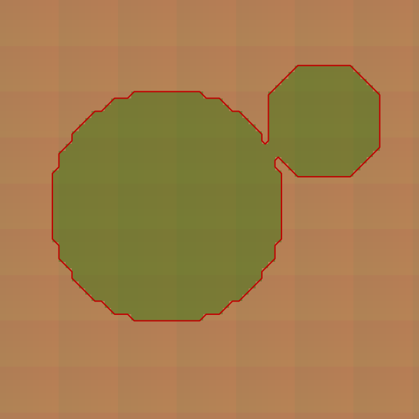

# GeoAI foundation-model land-cover segmentation

Extract land features from georeferenced imagery with a plain-English prompt, export
a binary GeoTIFF and GeoJSON polygons, and measure their area in hectares. A second
track uses frozen **Clay v1.5** Earth-observation foundation-model embeddings for a
forest-vs-non-forest classifier with held-out metrics and bootstrap confidence intervals.

This repository is a reproducible portfolio demonstrator for sustainability-oriented
remote sensing. It emphasizes geospatial correctness, bounded execution, and honest
reporting over a polished but unverifiable model claim.

## What is included

```text
small WGS84 AOI -> satellite GeoTIFF -> GroundingDINO + SAM 2
                                         |
                                         +-> binary mask.tif
                                         +-> polygons in mask.geojson
                                         +-> summary.json (hectares)
                                         +-> preview.png

normalized sensor chips -> Clay v1.5 frozen encoder -> embeddings
                                                    -> logistic classifier
                                                    -> held-out metrics + 95% CIs
```

- **Track A:** current SAMGeo `LangSAM` API with the smaller `sam2-hiera-tiny`
  default, georeferenced outputs, local-UTM area measurement, and one-command CLI.
- **Track B2:** official Clay v1.5 checkpoint interface, explicit wavelength and
  timestamp inputs, frozen embeddings, deterministic stratified evaluation, and
  persisted model/split metadata.
- **Engineering:** tiny offline GeoTIFF fixture, unit and smoke tests, pinned
  dependencies, Docker, GitHub Actions, notebook, configuration examples, and a
  bounded Pydantic agent-tool schema.



*Track A on real imagery: `LangSAM` (GroundingDINO + SAM 2, `sam2-hiera-tiny`) with the
prompt `"trees"` over a small AOI near Pekanbaru, Riau, Indonesia (bbox
`101.435, 0.450, 101.445, 0.460`, zoom 17, box/text threshold 0.24). The red overlay is
the predicted vegetation mask; it tracks tree cover while excluding the runway, buildings,
and cleared/bare ground. Result: 84 polygons, 80.3 ha. Basemap: Esri World Imagery,
retrieved 2026-08-05 — imagery © Esri and its data providers. This is a demonstrator
output, not a validated accuracy claim; see [Scope and limitations](#scope-and-limitations).*



*Offline CI fixture preview: the red overlay denotes the deterministic contract-test mask.
The image is synthetic and demonstrates output wiring only; it is not a SAMGeo quality
claim. A real model run writes the same `preview.png` artifact.*

## Quickstart

Python 3.11+ is supported. The lightweight environment exercises all geospatial and
classifier code without downloading multi-gigabyte weights:

```bash
python -m venv .venv
source .venv/bin/activate                 # Windows: .venv\Scripts\activate
pip install -r requirements.txt
pip install -e .
pytest -m "not network" -q
```

Install Track A and fetch a small public basemap tile:

```bash
pip install -r requirements-models.txt
geoai fetch --bbox 101.435 0.450 101.445 0.460 --out data/riau.tif --zoom 17
geoai segment --image data/riau.tif --prompt "trees" --output-dir outputs/trees
```

The first segmentation run downloads GroundingDINO and SAM weights. The command
prints a manifest and writes:

| Output | Meaning |
|---|---|
| `mask.tif` | single-band, georeferenced binary mask |
| `mask.geojson` | WGS84 polygons with `class_name` and `area_ha` |
| `summary.json` | polygon count and total hectares |
| `preview.png` | RGB overlay for rapid visual inspection |

Prompt quality varies. Tune `--box-threshold`, `--text-threshold`, and
`--min-area-ha` against a labelled validation set rather than selecting thresholds
from a visually favourable example.

## Track B2: Clay v1.5 downstream classification

Install the official Clay package and download its Apache-2.0 checkpoint:

```bash
pip install -r requirements-clay.txt
hf download made-with-clay/Clay v1.5/clay-v1.5.ckpt --local-dir models/clay
```

Prepare an NPZ with:

- `chips`: normalized `float32` array `[N, C, H, W]`;
- `timestamps`: `[N, 4]` containing week, hour, latitude, longitude;
- `wavelengths`: nanometres in `[C]` or `[N, C]`;
- optional `labels`: binary forest/non-forest labels.

Use the official Clay `metadata.yaml` means and standard deviations for the selected
sensor. The example in [configs/clay_sentinel2.yaml](configs/clay_sentinel2.yaml)
documents the Sentinel-2 band order but intentionally does not invent normalization
statistics.

```bash
geoai clay-embed \
  --input data/chips/prepared.npz \
  --checkpoint models/clay/v1.5/clay-v1.5.ckpt \
  --output outputs/clay/embeddings.npz \
  --device cuda

geoai clay-classify \
  --embeddings outputs/clay/embeddings.npz \
  --output-dir outputs/clay/experiment
```

`metrics.json` includes accuracy, balanced accuracy, F1, percentile-bootstrap 95%
confidence intervals, the random seed, and exact train/test indices. Chips from the
same geographic scene should be grouped before splitting in a real study; the generic
CLI cannot infer scene membership. Embedding files generated by this project also
carry the checkpoint SHA-256; external NPZ files without provenance are explicitly
marked `unverified embeddings` in the report.

### Reported results

No real-world Clay benchmark score is committed because no labelled study dataset was
provided with this repository. The synthetic classifier test is a CI contract test,
not scientific evidence, and its score is deliberately excluded here. Run the command
above on a versioned, spatially independent dataset and commit its `metrics.json`
before placing a numeric result on a CV.

## Notebook and configuration

[notebooks/01_samgeo_text_prompt.ipynb](notebooks/01_samgeo_text_prompt.ipynb)
walks through the Track A flow. [configs/samgeo.yaml](configs/samgeo.yaml) records a
small Riau AOI and thresholds; all production-facing CLI values remain explicit.

## Schema-validated agent tool

`src.agent_tool.SegmentRequest` restricts prompt length, coordinate order, latitude,
longitude, zoom, and AOI size. `segment(request)` is suitable as the implementation
behind an LLM function call. Validation does not make arbitrary LLM execution safe by
itself: callers should still add authentication, quotas, timeouts, and job isolation.

## Docker

The default image is CPU-only and runs the offline smoke test:

```bash
docker build -t geoai-segmentation .
docker run --rm geoai-segmentation
```

For Track A inference, build the optional model image and mount writable model/output
caches. For GPU use, start from an NVIDIA CUDA runtime with a matching PyTorch wheel.

```bash
docker build -f Dockerfile.models -t geoai-segmentation:models .
docker run --rm -v "$PWD/outputs:/app/outputs" geoai-segmentation:models \
  segment --image data/sample/tile.tif --prompt trees
```

## Scope and limitations

- This is **not a new model**, an operational monitoring platform, or evidence of
  regulatory compliance. It is a demonstrator on public/small sample tiles.
- The committed fixture is synthetic and exists only for deterministic, offline CI.
  It is not presented as an accuracy or visual-quality result.
- Basemap imagery may differ by provider, date, resolution, licence, and atmospheric
  conditions. Preserve the provider/date/source metadata for any published result.
- GroundingDINO and SAM were not trained specifically for every satellite sensor or
  class. Text prompts such as “oil palm” or “clearing” can yield false positives and
  should be validated against independent labels.
- Track A text-prompt segmentation suits **visually distinct** features (vegetation vs
  water, buildings, or bare soil). **Spectrally similar** classes — for example forest
  vs pasture over a lush frontier — are not separable by a text prompt: the mask floods
  to nearly the whole scene. That discrimination is a **Track B** job (Clay embeddings
  plus a trained classifier), which is the correct tool for forest-vs-non-forest.
- Pixel masks inherit the source georeferencing but not its positional accuracy.
- Small polygons are sensitive to raster resolution and projection. Areas are measured
  in a local UTM CRS, but uncertainty from segmentation and source data is not captured.
- Clay quality depends on correct band order, wavelength metadata, normalization,
  ground sampling distance, time/location encoding, and spatially independent splits.
- CPU execution is possible but slow. A GPU is recommended for foundation-model
  inference; model weights are never downloaded in CI.

## Model and data attribution

- [SAMGeo / segment-geospatial](https://github.com/opengeos/segment-geospatial), MIT,
  by Qiusheng Wu and contributors.
- [Segment Anything](https://github.com/facebookresearch/segment-anything) and
  [SAM 2](https://github.com/facebookresearch/sam2), Meta.
- [GroundingDINO](https://github.com/IDEA-Research/GroundingDINO), IDEA Research.
- [Clay Foundation Model v1.5](https://huggingface.co/made-with-clay/Clay),
  Apache-2.0, Clay Foundation / Radiant Earth.
- Web-map tiles retain their provider's terms and required attribution. Do not publish
  downloaded imagery without checking those terms.

See each upstream model card for its training data, intended use, and licence. This
repository's MIT licence does not relicense model weights or imagery.

## Development

```bash
make fixture
make lint
make test
```

CI runs Ruff plus the offline test suite on Python 3.11 and never fetches imagery or
model weights.
